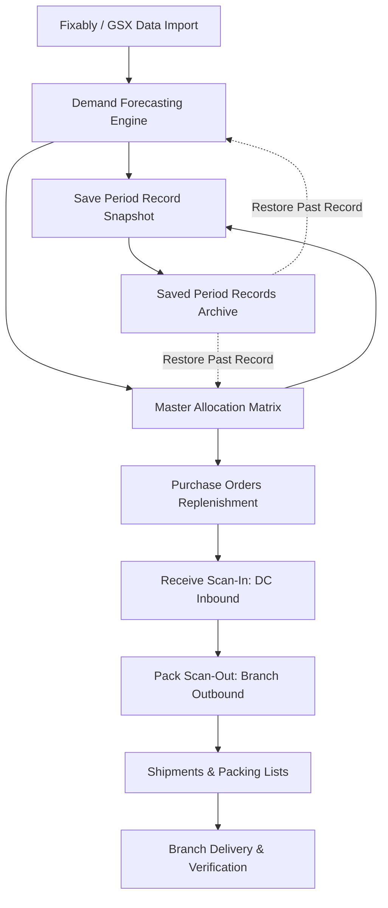

# DC System: Distribution Center Parts Allocation & Reporting System

**DC System** is the central logistics, demand forecasting, and inventory allocation platform for **Mobile Care Services Philippines Inc. (MDC)**. It manages serialized Apple service parts across the central Main Distribution Center (DC) and 26 Authorized Service Provider (ASP) branches nationwide.

---

## 🚀 Quick Start for First-Time Users

### 1. First-Time Login & Password Configuration
When you access the system for the first time:
1. Enter your provisioned company email address (e.g. `zhon.manaois@mobilecareph.com` or `joshua.juvida@mobilecareph.com`).
2. If your account is newly provisioned, the system prompts you to **Set Up Your Password** before entering.
3. Once configured, you will be automatically directed to your dashboard based on your role permissions.

### 2. User Roles & Default Permissions
| Role | Access Scope | Intended Users |
|---|---|---|
| **Superadmin** | Full access to all 12 modules + User Access Management | System Administrators, IT Leads |
| **Admin** | Planning, Forecasting, Allocations, Shipments, Audit, Catalog | Supply Chain Managers, Inventory Leads |
| **Warehouse Staff** | Receive Scan-In (F1), Pack Scan-Out (F2), Allocations, Shipments | DC Warehouse Operations Staff |
| **Site Staff** | Branch overview, Incoming Shipments & Packing Lists | ASP Branch Technicians & Store Leads |
| **Management / Viewer** | Demand Forecasts, Allocations, Shipments, Audit Logs | Executive & Operations Management |

---

## 🔄 End-to-End System Workflow



---

### Step 1: Data Import (ETL Pipeline)
* **Path:** `Planning` → `Fixably / GSX Data Import`
* **Purpose:** Ingests monthly repair usage data, parts catalog updates, and workbook bundles.
* **How to use:**
  1. Drag & drop or browse for your GSX/Fixably export (`.xlsx` or `.csv`).
  2. Select the matching parser format:
     - **Workbook Bundle:** Imports full forecasting + master allocation matrices simultaneously.
     - **Demand Forecast Sheet:** Imports historical monthly usage counts (Jan–Aug).
     - **Master Allocation Sheet:** Ingests 26-branch allocation tables.
     - **Serialized Stock / Usage:** Ingests in-stock serial numbers or repair tickets.
  3. Review the parsed preview table, then click **Apply Dataset**.

---

### Step 2: Demand Forecasting Engine
* **Path:** `Planning` → `Demand Forecasting`
* **Purpose:** Computes linear regression demand forecasts ($y = \alpha + \beta x$) with safety stock buffers.
* **How to use:**
  1. Inspect historical monthly repair counts per part number.
  2. Adjust the **Safety Stock Buffer** slider (0% to 20%, default: 5%).
  3. If required, input manual overrides in the **Admin Override** column.
  4. The system automatically recalculates the **Recommended Order** quantity.
  5. Click **Export Excel** to generate a downloadable demand report.

---

### Step 3: Saving Period Records (Historical Versioning)
* **Path:** `Planning` → `Demand Forecasting` or `Allocation Matrix` → **Save as Record**
* **Purpose:** Captures permanent, immutable snapshots of forecasting and allocation tables (like creating a new dated tab in a spreadsheet) so next month's/week's data never overwrites historical archives.
* **How to use:**
  1. Click **Save as Record** in the header.
  2. Select **Year** (e.g., `2026`), **Month** (e.g., `August`), and optional **Week Number** (1–4 or Full Month).
  3. Choose scope:
     - **Full Bundle:** Captures both Forecasting and Allocation tables.
     - **Forecasting Only:** Captures active forecast numbers and overrides.
     - **Allocation Only:** Captures multi-site matrix quantities and weekly splits.
  4. The period label auto-generates (e.g. `August 2026 – Week 1`) or can be customized.
  5. Add optional notes (e.g. *"Approved by Management with 5% safety buffer"*).
  6. Click **Save Period Record**. The snapshot is saved locally and backed up to the cloud.

---

### Step 4: Master Parts Allocation Matrix
* **Path:** `Warehouse Operations` → `Allocation Matrix`
* **Purpose:** Multi-site distribution of parts across 26 ASP branches matching official Google Sheet structures.
* **How to use:**
  1. Switch between **Full Master Matrix** (quantities) and **Site Share %** views.
  2. Input branch allocation quantities directly into the site cells, or click **Fair Split** to automatically distribute available stock using the proportional Hamilton-Hare quota algorithm.
  3. The system computes 4-week batch splits (`W1`, `W2`, `W3`, `W4`), total allocated units, financial inventory valuation, and status badges (`ORDER REQUIRED` vs `NO NEED TO ORDER`).
  4. Export to Excel anytime via the **Export Excel** button.

---

### Step 5: Saved Period Records & History Archive
* **Path:** `Planning` → `Saved Period Records`
* **Purpose:** Central repository to search, inspect, and restore previous period records.
* **How to use:**
  - **Search & Filter:** Filter archives by label, year, month, or record type (`Full Bundle`, `Forecast`, `Allocation`).
  - **Inspect:** Click **Inspect** to view read-only snapshot tables for any past period without touching your active workspace.
  - **Restore:** Click **Restore** to reload a historical snapshot back into your active working tables to resume editing or re-export.
  - **Delete:** Permanently remove old or test records with a confirmation prompt.

---

### Step 6: Purchase Orders (Inbound Replenishment)
* **Path:** `Planning` → `Purchase Orders`
* **Purpose:** Tracks Apple supplier orders, expected delivery dates, and receiving fulfillment statuses (`draft`, `submitted`, `partially_received`, `received`, `closed`).

---

### Step 7: Receive Scan-In (DC Inbound Receiving)
* **Path:** `Warehouse Operations` → `Receive Scan-In` (Hotkey: `F1`)
* **Purpose:** Barcode-driven receiving into DC stock.
* **How to use:**
  - **Physical Scanner:** Focus the barcode field and scan the Part Number followed by the Serial Number. Audio chimes confirm valid scans or alert on duplicates.
  - **Batch XLSX Import:** Click **Batch Import Scans** to upload bulk serialized spreadsheets from supplier manifests.

---

### Step 8: Pack Scan-Out & Packing Lists
* **Path:** `Warehouse Operations` → `Pack Scan-Out` (Hotkey: `F2`)
* **Purpose:** Scans in-stock parts into outbound boxes assigned to target branch locations.
* **How to use:**
  1. Select the destination branch site and active packing draft.
  2. Scan serial numbers into Box 1, Box 2, etc.
  3. Click **Finalize Packing List** to generate the official shipment manifest.

---

### Step 9: Shipments & Packing Manifests
* **Path:** `Distribution` → `Shipments & Packing Lists`
* **Purpose:** Manages dispatch tracking, carrier info (Lite Express), waybill tracking numbers, and printable Apple-standard Packing Lists with signature sign-offs.

---

### Step 10: Traceability & Serialized Audit Log
* **Path:** `Traceability` → `Serialized Audit Log`
* **Purpose:** Complete end-to-end timeline for every serial number, tracking who received it, when it was packed, and which shipment invoice it was dispatched under.

---

## ⌨️ Global Keyboard Shortcuts

| Shortcut | Action | Description |
|---|---|---|
| `F1` | **Receive Scan-In** | Instantly switches to the physical barcode receiving terminal. |
| `F2` | **Pack Scan-Out** | Instantly switches to the outbound packing list scanner. |

---

## 🛠️ Technology Stack & Architecture

- **Frontend:** React 18, Vite, Lucide Icons, SheetJS (`xlsx`), HTML2Canvas.
- **Backend & Database:** Supabase PostgreSQL, Row Level Security (RLS), Realtime Channels.
- **Storage Strategy:** Local-First (`localStorage`) with non-blocking cloud backup. Data resets (`clearAllData` / `resetToDefaultData`) clear active operational tables while strictly preserving historical `saved_records`.

---

## 💻 Development & Deployment Commands

```bash
# 1. Install project dependencies
npm install

# 2. Run local development server
npm run dev

# 3. Build optimized production bundle
npm run build
```

---

## 📁 Database Migrations
Database schemas and migrations are located in `src/supabase/`:
- `schema.sql`: Complete PostgreSQL schema with authentication, RBAC, inventory, and period snapshots.
- `saved_records_migration.sql`: Dedicated migration script for the `saved_records` JSONB table and RLS policies.
